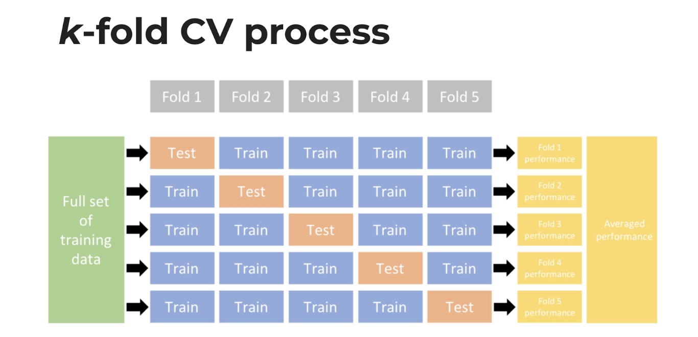

This week's lab is a musical lab. You'll be requesting data from the Spotify API and using it to build k-nearest neighbor and decision tree models.

In order to use the Spotify you must have a Spotify account. If you don't have one, sign up for a free one here: <https://www.spotify.com/us/signup>

Once you have an account, go to Spotify for developers (<https://developer.spotify.com/>) and log in. Click the green "Create a Client ID" button to fill out the form to create an app create an app so you can access the API.

On your developer dashboard page, click on the new app you just created. On the app's dashboard page you will find your Client ID just under the header name of your app. Click "Show Client Secret" to access your secondary Client ID. When you do this you'll be issued a Spotify client ID and client secret key.

You have two options for completing this lab.

**Option 1**: **Classify by users**. Build models that predict whether a given song will be in your collection vs. a partner in class. This requires that you were already a Spotify user so you have enough data to work with. You will download your data from the Spotify API and then exchange with another member of class. **I will go with Option 1**

Load the Libraries

```{r}

library(spotifyr) #API interaction
library(tidyverse)
library(tidymodels)
library(caret)
library(kknn)
library(baguette)
library(ranger)
library(kableExtra)

```

Client ID and Client Secret are required to create and access token that is required to interact with the API. You can set them as system values so we don't have to do provide them each time.

```{r}

Sys.setenv(SPOTIFY_CLIENT_ID = "9ce798ee305041ddbb318b62aec6def7")
Sys.setenv(SPOTIFY_CLIENT_SECRET = "42fb5974467c4162871b397da738a104")

access_token <- get_spotify_access_token()

```

Sys.setenv(SPOTIFY_CLIENT_ID = '2e066a0ebf86473990f30eee626c4ab9') Sys.setenv(SPOTIFY_CLIENT_SECRET = 'bb6735cb728a42089e0cc02680c97844')

access_token \<- get_spotify_access_token() #takes ID and SECRET, sends to Spotify and receives an access token

> *This may result in an error:*
>
> INVALID_CLIENT: Invalid redirect URI
>
> *This can be resolved by editing the callback settings on your app. Go to your app and click "Edit Settings". Under redirect URLs paste this: <http://localhost:1410/> and click save at the bottom.*

#### **Option 1: Data Preparation**

You can use get_my_saved_tracks() to request all your liked tracks. It would be good if you had at least 150-200 liked tracks so the model has enough data to work with. If you don't have enough liked tracks, you can instead use get_my_recently_played(), and in that case grab at least 500 recently played tracks if you can.

The Spotify API returns a data frame of tracks and associated attributes. However, it will only return up to 50 (or 20) tracks at a time, so you will have to make multiple requests. Use a function to combine all your requests in one call.

Create a function that gives me the number of songs I want to select

```{r}

get_my_loved_songs <- function(n) {
  df <- data.frame()
  x <- n/50
  offset <- 0
  
  for (i in 1:x) {
    new_tracks <- get_my_saved_tracks(limit=50, 
                                      offset = offset,
                                      include_meta_info = FALSE)
    df <- rbind(df,new_tracks)
    offset <- offset + 51
    }
  return(df)
  }

javier_tracks <- get_my_loved_songs(200)

```

Create a function that prints out the features of all the songs

```{r}

extract_features <- function(track_id) {
  df <- data.frame()
  id_num <- 0
  x <- length(track_id)/100
  for (i in 1:x) {
    new_tracks_features <- get_track_audio_features(track_id[(id_num+1):(id_num+100)])
    df <- rbind(df, as.data.frame(new_tracks_features))
    id_num <- id_num + 100
    }
  return(df)
}

track_features <- extract_features(javier_tracks$track.id)

```

Edit and clean my data frame

```{r}
tracks_df_javier <- track_features |> 
  add_column(javier_tracks$track.name) |> 
  select(-c(track_href, type, uri, analysis_url, id)) |> 
  mutate(user = "javier") |> 
  rename(name = "javier_tracks$track.name") |> 
  relocate(c(name, user))

```

Write my data frame for export

```{r}
write_csv(tracks_df_javier, here::here("tracks_df_javier.csv"))

```

# **Modeling**

## Create four final candidate models:

1.  KNN Model neighbor model
2.  Decision tree model
3.  Bagged Tree
4.  Random Forest

Go through the modeling process for each model:

**Preprocessing:** You can use the same recipe for all the models you create. **Resampling:** Make sure to use appropriate resampling to select the best version created by each algorithm. Tuning. Find the best values for each hyperparameter (within a reasonable range). Compare the performance of the four final models you have created.

Use appropriate performance evaluation metric(s) for this classification task. A table would be a good way to display your comparison. Use at least one visualization illustrating your model results.

Merging the both data sets

```{r}

tracks_df_pol <- read_csv("tracks_df_pol.csv") |> 
  select(-c(id))

full_df <- rbind(tracks_df_javier,tracks_df_pol) |> 
  select(-c(name))

full_df$user <- as.factor(full_df$user)

```

Creating a Summarised Data Set for general info and differences between Pol´s and Me

```{r}

general_comparison <- full_df |> 
  group_by(user) |> 
  summarise(dance = mean(danceability),
            energy = mean(energy),
            loudness = mean(loudness),
            speechiness = mean(speechiness),
            acousticness = mean(acousticness),
            instrumentalness = mean(instrumentalness),
            liveness = mean(liveness),
            tempo = mean(tempo)) 

kable(general_comparison,
      padding = 1,
      digits = round(3), 
      align = "c",
      format = "pipe",
      caption = "Music Comparision Summary")
```

```{r}
set.seed(123)
#initial split of data, default 75/25

full_split <- initial_split(full_df, prop = .75)
full_train <- training(full_split)
full_test <- testing(full_split)

```

We need to create a recipe and do the pre-processing by converting dummy coding the nominal variables and normalizing the numeric variables.

```{r recipe}
#pre-processing
recipe <- recipe(user ~ . ,
                 data = full_df) |> 
  prep()

#bake with the train data
baked_train <- bake(recipe, full_train)

#bake with the test data
baked_test <- bake(recipe, full_test)

```

## 1. KNN Model

Specify the k-nearest neighbor model

```{r knn_spec}
knn_spec <- nearest_neighbor() |> #select the type of model
  set_engine("kknn") |> 
  set_mode("classification")

```

Fit the new KNN specification to the training data.

```{r}
knn_fit <- knn_spec %>% 
  fit(user ~. , data = full_train)
```

Now create the 5 folds we want to divide the data frame on

```{r cv}
set.seed(123)

# 10-fold CV on the training data set
cv_folds <- vfold_cv(full_df, v = 10)

```

{width="80%"}

As you can see in the image above a k-fold CV process of five folds look like this.

We now have a recipe for processing the data, a model specification, and CV splits for the training data. Let's put it all together in a workflow.

```{r}
knn_workflow <- workflow() |> 
  add_model(knn_spec) |> 
  add_recipe(recipe)
```

Now fit the resamples.

```{r}
set.seed(123)

knn_resample <- knn_workflow |> 
  fit_resamples(resamples = cv_folds,
                control = control_resamples(save_pred = TRUE))
```

Check the performance
```{r}

simple_knn_metrics <- 
  knn_resample %>% 
  collect_metrics(summarise = TRUE) %>%
  mutate(model = "Simple KNN")
```

The simple_knn_metrics has a total performance of 0.592. Lets see if we can make it better with the tunning

#### KNN with Tunning

Now lets analyse what the tune() parameter does to the final metrics.
```{r spec_with_tuning}
# Define our KNN model with tuning
knn_spec_tune <- nearest_neighbor(neighbors = tune()) |> 
  set_mode("classification") |>  
  set_engine("kknn")

```

```{r}
# Define a new workflow
wf_knn_tune <- workflow() |> 
  add_model(knn_spec_tune) |> 
  add_recipe(recipe)
    
# Fit the workflow on our predefined folds and hyperparameters
fit_knn_cv <- wf_knn_tune |> 
  tune_grid(
    cv_folds, 
    grid = data.frame(neighbors = c(1, 5, 10, seq(20,100,10)))
  )
    
# Check the performance with collect_metrics()
fit_knn_cv %>% collect_metrics()

```

Create the final workflow and final fit within the knn_cv process The finalize_workflow() function wants (1) your initial workflow and (2) your best model.

```{r}
# The final workflow for our KNN model
final_wf <- wf_knn_tune |> 
  finalize_workflow(select_best(fit_knn_cv, metric = "accuracy")) 

# Fitting our final workflow
final_fit = final_wf %>% fit(data = full_train)
```

```{r}
# Write over 'final_fit' with this last_fit() approach
final_knn_fit <- final_fit %>% last_fit(full_split)

# Collect metrics on the test data for the final comparison
knn_metrics <- 
  final_knn_fit %>% 
  collect_metrics(summarise = TRUE) %>%
  mutate(model = "KNN")

```

## 2. Decision Tree

Model Specs
```{r}
# Create model specification 
tree_spec <- decision_tree(
  cost_complexity = tune(), 
  tree_depth = tune(), 
  min_n = tune()) |> 
  set_engine("rpart") |> 
  set_mode("classification")
```

Model Grid
```{r}
#Create a grid to be filled
tree_grid <- grid_regular(cost_complexity(), 
                          tree_depth(), 
                          min_n(), 
                          levels = 5)
```

Model Work Flow
```{r}
# create the workflow for this decision tree
wf_tree <- workflow() |> 
  add_recipe(recipe) |> 
  add_model(tree_spec)

```

```{r}
#set up k-fold CV. This can be used for all the algorithms
set.seed(123)

songs_cv = full_train |> 
  vfold_cv(v = 5)

```

```{r}
doParallel::registerDoParallel() # Run build trees in parallel

tree_rs <- tune_grid(
  tree_spec, # model specification
  user ~ .,  # features to use
  resamples = songs_cv, 
  grid = tree_grid, # Select which grid will be used
  metrics = metric_set(accuracy)  # which combination is the best 
)

```

Use autoplot() to examine how different parameter configurations relate to accuracy

```{r, fig.align='center', out.width="60%"}
autoplot(tree_rs) + theme_light()
```

Select the best hyperparrameters:

```{r}
# is you want to actually see the best values for accuracy
show_best(tree_rs) 
# model has to actually use one
select_best(tree_rs) # gives us the best hyper-parameters to use for our model
```

We can finalize the model specification where we have replaced the tune functions with optimized values.

```{r final_tree_spec}
final_tree <- finalize_model(tree_spec, 
                             select_best(tree_rs))
```

Lets do a last_fit

```{r final_tree_fit}
final_tree_fit <- last_fit(final_tree, # give final specification
                           user ~ ., # give final model call
                           full_split # give genre split data because this is doing the training and prediction same time
)


# Collect metrics on the test data for the final comparison
tree_metrics <- 
  final_tree_fit %>% 
  collect_metrics(summarise = TRUE) %>%
  mutate(model = "Decision Tree")

```

## 3. Bagged Tree

Bagged tree - bag_tree() - Use the "times =" argument when setting the engine during model specification to specify the number of trees. The rule of thumb is that 50-500 trees is usually sufficient. The bottom of that range should be sufficient here.

Create the model´s specs

```{r}
# Create model specification 

bagging_spec <- bag_tree(
  cost_complexity = tune(), 
  tree_depth = tune(), 
  min_n = tune(),
  mode = "classification", 
) |> set_engine("rpart", times = 50) # Number of Trees (Bootrap Resamples). They should be between 50-500

```

Create the grid for the model

```{r}
bagging_grid <- grid_regular(cost_complexity(), 
                              tree_depth(), 
                              min_n(), 
                              levels = 5) # how many levels will the tune try
```

Create the Bagging work flow

```{r}
# Create the workflow 
bagging_wf <- workflow() |> 
  add_recipe(recipe) |> 
  add_model(bagging_spec)

```

```{r}
# determine best combination of tuned hyperparamters
doParallel::registerDoParallel() #build trees in parallel

bag_tree_rs <- tune_grid(
  bagging_spec, # model specification
  user ~ .,  # features to use
  resamples = songs_cv, # put the resamples that we created above
  grid = bagging_grid, # which grid
  metrics = metric_set(accuracy)  # which combination is the best
)
```

```{r}
# Use autoplot() to examine how different parameter configurations relate to accuracy
autoplot(bag_tree_rs) + theme_light()

# select the best combination of hyperparameters
# if you want to actually see the best values for accuracy
show_best(bag_tree_rs)

# model has to actually use one
select_best(bag_tree_rs) # gives us the best hyperparamters to use for our model


# finalize our model with the best hyperparamters
final_bagged_tree <- finalize_model(bagging_spec,
                             select_best(bag_tree_rs))
```

```{r}
# fit model to testing data and view predictions:
final_bagged_fit <- last_fit(final_bagged_tree, # give final specification
                           user ~ ., # give final model call
                           full_split # give genre split data because this is doing the training and prediction same time
                           )


# Collect metrics on the test data for the final comparison
bagged_metrics <-
  final_bagged_fit %>%
  collect_metrics(summarise = TRUE) %>%
  mutate(model = "Bagging")

```

## 4. Random Forest

Random Forest - rand_forest() - m_try() is the new hyperparameter of interest for this type of model. Make sure to include it in your tuning process

Create the Random Forest Spec

```{r}
# create model specification
forest_spec <- rand_forest(
  trees = 1000, 
  min_n = tune(),
  mtry = tune(),
  mode = "classification",
  engine = "ranger" 
) 

```

```{r}
# Bundle model spec with recipe into workflow
wf_forest <- workflow() |> 
  add_recipe(recipe = recipe) |> 
  add_model(forest_spec)

```

```{r}
# use 10 fold cross validation to tune hyperparamters 
set.seed(123)
random_folds <- vfold_cv(full_train) 

```

```{r}
# run this in parallel so that is goes faster: 
set.seed(123)
doParallel::registerDoParallel()

# create tuning grid
random_grid <- grid_regular(min_n(), mtry(range = c(1,5)))
```

```{r}
# tune the hyperparameters with the above created grid
forest_resample <- tune_grid(
  wf_forest,
  resamples = random_folds,
  grid = random_grid)
```

```{r}
# visualize results of hyperparameter tuning: 
autoplot(forest_resample) + theme_light()

# select best hyperparameters
show_best(forest_resample)

select_best(forest_resample) 

```

```{r}
# Finalize the model
final_forest <- finalize_model(forest_spec, 
                             select_best(forest_resample))

# Fit the model to the testing data!
final_forest_fit <- last_fit(final_forest, 
                           user ~ . , 
                           full_split)
```

```{r}
# Collect metrics on the test data for the final comparison
forest_metrics <- 
  final_forest_fit %>% 
  collect_metrics(summarise = TRUE) %>%
  mutate(model = "Forest")

```

Create the final table with the results of the models

```{r}
final_results <- bind_rows(knn_metrics, tree_metrics, bagged_metrics, forest_metrics)

```

```{r}
final_table <- final_results |> 
  select(model, .metric, .estimate) |> 
  pivot_wider(names_from = .metric, values_from = .estimate) |> 
  arrange(accuracy) |> 
  mutate(model = fct_reorder(model, accuracy))

```

Create the final Table

```{r}
kable(final_table,
      padding = 1,
      digits = round(3),
      align = "c",
      format = "pipe",
      caption = "Model Comparision Summary")
```

Create the final graph comparison

```{r}
final_table %>% 
  ggplot(aes(x = model, y = accuracy, fill= model)) +
  geom_col() +
  labs(title = "Final Model Graph Comparison",
       x = "Type of Model",
       y = "Model´s Accuracy") +
  geom_text(
    size = 5,
    aes(label = round(accuracy, 3), y = accuracy + 0.05),
    vjust = 1, 
    color = "gray30")
```

Overall, the tuned nearest neighbors or "KNN" was the most accurate model. In general Pol and me have similar music tastes as you can see in the `general_comparison` table. In this case, it is hard for the models to separate, classify and predict between the users (listeners), and that is why we have seen relative low accuracy in comparison to other people that they may have really different taste of music.
